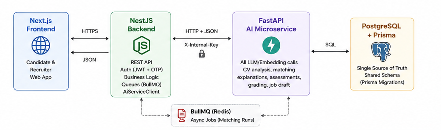
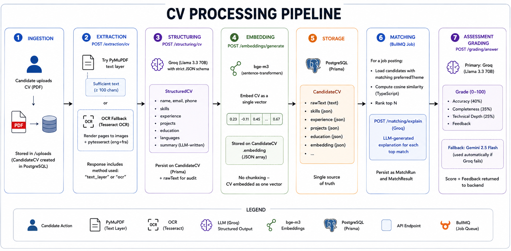

# AI-Powered Internship Platform

A full-stack platform that connects students with internship opportunities using AI-driven CV analysis, candidate–offer matching, and automated technical assessments.

Built as a major academic project at **ISIMM** (Institut Supérieur d'Informatique et de Mathématiques de Monastir).

---

## Overview

The platform lets recruiters publish internship postings and lets candidates build a profile and apply to a general talent pool. Behind the scenes, an AI microservice powers CV parsing, semantic candidate–offer matching, AI-generated technical assessments, and automated grading — while the core business logic, auth, and orchestration live in a separate backend service.

## Architecture



The system is split into three main services plus a shared database layer:

| Service | Role |
|---|---|
| **NestJS backend** | REST API, auth (JWT + OTP), business logic, job queues, orchestrates all AI calls through an internal `AiServiceClient` |
| **Next.js frontend** | Candidate and recruiter-facing web app |
| **FastAPI AI microservice** | Owns every LLM/embedding call: CV analysis, matching explanations, assessment generation & grading, job posting drafts |
| **PostgreSQL + Prisma** | Single source of truth, shared schema managed via Prisma migrations |

**Key architectural rule:** all LLM calls live exclusively in the FastAPI service. The NestJS backend never calls an LLM provider directly — it always goes through `AiServiceClient`, authenticated internally via a shared `X-Internal-Key` header. This keeps AI logic swappable and isolated from core business logic.

### AI stack

- **Embeddings:** `bge-m3` (via `sentence-transformers`), run locally/CPU
- **Primary LLM:** Groq (Llama 3.3 70B) — fast, low-cost generation
- **Fallback LLM:** Gemini 2.5 Flash — used when Groq is unavailable/rate-limited
- **Matching:** cosine similarity computed locally, with LLM-generated explanations for each match via `/matching/explain`
- **Job queue:** BullMQ for async matching runs (`MatchRun` / `MatchResult` persisted in Postgres)

## Features

- **Candidate profiles & CV analysis** — structured CV parsing (skills, education, projects) with real project citations extracted from uploaded CVs
- **Matching engine** — general talent-pool model: candidates apply once with a `preferredTheme`, matched against postings via embeddings + LLM-explained results
- **AI-assisted job posting generation** — recruiters get a stateless AI-generated draft (`/postings/generate`) they can review before committing to the database
- **Assessment pipeline** — end-to-end: AI-generated questions → candidate test-taking → tab-switch detection (anti-cheat) → AI grading → recruiter results dashboard
- **Smart candidate picker** — AI-assisted shortlist when publishing an assessment
- **Auth** — JWT with refresh tokens, OTP-based email verification
- *(In progress)* Google Calendar integration for deadline suggestions
- *(Exploratory)* LangGraph-based agent module (ReAct loop, persistent memory via `PostgresSaver`/`PostgresStore`, MCP tool exposure of platform endpoints) as a future addition to the AI microservice

## CV Processing Pipeline



The CV pipeline runs across both services: NestJS handles upload/persistence, FastAPI handles every AI-heavy step.

1. **Ingestion** — candidate uploads a CV as a PDF (`uploads` module on the NestJS side); the file is stored and a `CandidateCV` row is created/linked to the candidate.
2. **Extraction** (`POST /extraction/cv`) — PDF text is pulled with PyMuPDF's embedded text layer first (`extract_text_layer`). If the result is too short (< 100 chars, the heuristic used to flag scanned/image-only PDFs), it falls back to OCR via Tesseract (`pytesseract`, `eng+fra`) rendering each page to an image first. The response records which `method` was actually used (`text_layer` or `ocr`).
3. **Structuring** (`POST /structuring/cv`) — the raw extracted text is sent to Groq with a strict JSON-schema prompt, returning a `StructuredCV` (name, email, phone, skills, experience, projects, education, languages, and an LLM-written summary grounded in the CV's actual content). This structured data — plus the original `rawText` for audit — is persisted on the `CandidateCV` Prisma model (`skills`, `experience`/`education`/`projects` as JSON columns).
4. **Embedding** (`POST /embeddings/generate`) — the CV data is embedded as a single vector using `bge-m3` (`sentence-transformers`, CPU), stored as a JSON array on `CandidateCV.embedding`. Job posting descriptions are embedded through the same endpoint at match time, so both sides share the same model and vector space. There's currently no chunking step — the CV is embedded as one vector, not per-section.
5. **Storage** — embeddings live as a `Json` column directly on `CandidateCV` in PostgreSQL; there's no dedicated vector database or ANN index (no pgvector/FAISS) — the current scale doesn't need one.
6. **Matching** (`matching.processor.ts`, BullMQ job) — for a given posting, candidates with the matching `preferredTheme` are loaded, their stored embeddings compared to the job embedding with cosine similarity computed in plain TypeScript, and the top N ranked. Each of those top matches is then sent to `POST /matching/explain`, which asks Groq to justify the match given the CV summary, job description, and similarity score. Results are persisted as `MatchRun`/`MatchResult`.
7. **Assessment grading** (`POST /grading/answer`) — open-ended assessment answers reuse the same primary/fallback LLM strategy: Groq grades first (accuracy 40% / completeness 35% / technical depth 25%, returning a 0–100 score and feedback), and Gemini is used automatically if Groq fails.

## Tech Stack

**Backend:** NestJS, TypeScript, Prisma, PostgreSQL, BullMQ
**Frontend:** Next.js, TypeScript
**AI Service:** FastAPI, `sentence-transformers` (bge-m3), PyMuPDF, `pytesseract` (Tesseract OCR), Groq SDK, `google-genai` (Gemini)
**Infra:** Docker (AI service has a `Dockerfile`)

## Project Structure

```
.
├── backend/                     # NestJS API
│   ├── src/
│   │   ├── ai/                  # AiServiceClient — the only bridge to the FastAPI service
│   │   ├── applications/
│   │   ├── assessments/
│   │   ├── attempts/             # candidate test-taking flow
│   │   ├── auth/                 # JWT + refresh tokens + OTP
│   │   ├── candidates/
│   │   ├── matching/              # BullMQ processor + cosine similarity
│   │   ├── postings/
│   │   ├── questions/
│   │   └── uploads/               # CV upload handling
│   ├── prisma/                   # schema.prisma + migrations
│   └── uploads/cvs/               # stored candidate CV PDFs
│
├── ai-service-fastapi/ai-service/  # FastAPI AI microservice
│   └── app/
│       ├── api/v1/endpoints/      # extraction, structuring, embeddings, matching,
│       │                          # analysis, assessments, grading, postings,
│       │                          # scheduling, linkedin
│       ├── services/
│       │   ├── extraction/        # text_layer.py (PyMuPDF), ocr.py (Tesseract)
│       │   ├── embeddings/        # bge_provider.py (bge-m3)
│       │   └── llm/               # groq_provider.py, gemini_provider.py
│       ├── schemas/                # Pydantic request/response models
│       └── core/                   # config, internal-key auth
│
└── frontend/                     # Next.js app (candidate + recruiter UI)
```

## Getting Started

### Prerequisites

- Node.js (LTS)
- Python 3.10+ (for the AI microservice)
- PostgreSQL
- Docker & Docker Compose (recommended for local DB setup)

### Backend (NestJS)

```bash
cd backend
npm install

# configure environment
cp .env.example .env   # set DATABASE_URL, JWT secrets, AI_SERVICE_URL, X-Internal-Key, etc.

# run Prisma migrations
npx prisma migrate dev

# start in watch mode
npm run start:dev
```

### Frontend (Next.js)

```bash
cd frontend
npm install
npm run dev
```

### AI Microservice (FastAPI)

```bash
cd ai-service-fastapi/ai-service
pip install -r requirements.txt

# configure environment
cp .env.example .env   # set GROQ_API_KEY, GEMINI_API_KEY, X-Internal-Key, TESSERACT_CMD (if not on PATH)

uvicorn app.main:app --reload
```

> Note: OCR fallback requires Tesseract installed on the machine (with the `eng` and `fra` language packs), since `pytesseract` shells out to the local binary.

### Tests (from `backend/`)

```bash
# unit tests
npm run test

# e2e tests
npm run test:e2e

# coverage
npm run test:cov
```

## Environment Variables

| Variable | Used by | Description |
|---|---|---|
| `DATABASE_URL` | NestJS, Prisma | PostgreSQL connection string |
| `AI_SERVICE_URL` | NestJS | Base URL of the FastAPI service (must include `/api/v1`) |
| `X_INTERNAL_KEY` | NestJS, FastAPI | Shared secret for internal service-to-service auth |
| `JWT_SECRET` / `JWT_REFRESH_SECRET` | NestJS | Auth token signing |
| `GROQ_API_KEY` | FastAPI | Primary LLM provider |
| `GEMINI_API_KEY` | FastAPI | Fallback LLM provider |

## Roadmap

- [ ] Finish and test Google Calendar deadline suggestions
- [ ] Evaluate LangGraph agent module as an extension of the FastAPI service
- [ ] Expand recruiter analytics on assessment results

## Author

**Ichrak Hamza** — Software Engineering student at ISIMM (Institut Supérieur d'Informatique et de Mathématiques de Monastir)
